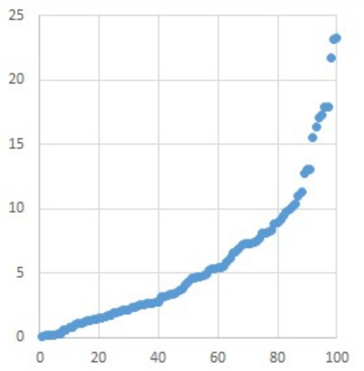
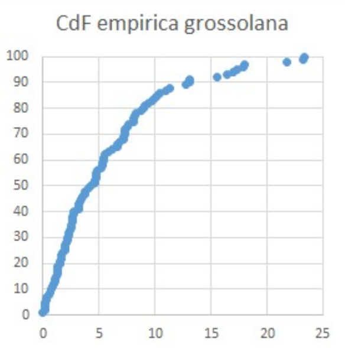
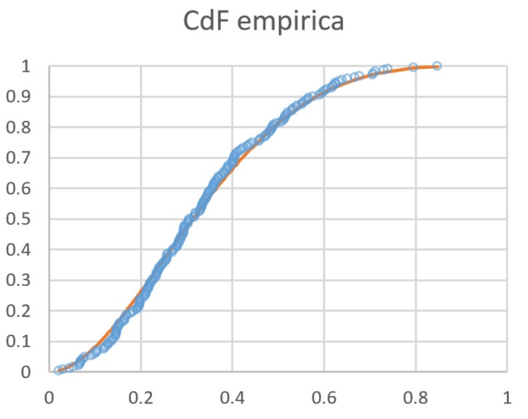

# Introduzione

## Machine Learning e Deep Learning. Differenze?

> Poiché i termini deep learning e machine learning tendono a essere usati in modo intercambiabile, vale la pena di notare le sfumature che li differenziano. Machine learning, deep learning e reti neurali sono tutti sottoinsiemi dell'intelligenza artificiale. Tuttavia, le reti neurali sono in realtà un sottoinsieme del machine learning, e il deep learning è un sottoinsieme delle reti neurali.
>
> Fonte [IBM](https://www.ibm.com/it-it/topics/machine-learning).

Il **Machine Learning** (in italiano "apprendimento automatico") è una branca
dell'intelligenza artificiale. Si occupa di strutturare sistemi in grado di
apprendere qualcosa dai dati in maniera autonoma, senza istruzioni esplicite. In
questo contesto, è comune utilizzare l'_etichettatura_ dei dati, ossia il
processo di identificazione dei dati non elaborati (immagini, file di testo,
video, ecc.) e l'aggiunta di una o più etichette significative e informative per
fornire il contesto in modo che un modello di machine learning possa imparare da
esso.

Il **Deep Learning** (in italiano "apprendimento profondo") è un sottoinsieme
del Machine Learning ed è specializzato nell'utilizzo di reti neurali
caratterizzate da un elevato numero di strati, capaci di estrarre informazioni
da una grande mole di dati anche _non etichettati_.

## Prerequisiti di Probabilità e Statistica (Cap. 4-8 del _Ross_)

- concetto di variabile aleatoria discreta e continua
- funzione di massa/densità
- funzione di ripartizione
- valore atteso
- variabili aleatorie congiunte

### Funzione di massa, densità, ripartizione

Sia $X$ una variabile aleatoria continua o discreta. Si definisce la sua
**funzione di densità** (nel caso continuo) o **funzione di massa** (nel caso discreto)
come la funzione $f$ o $p$ che verifica, rispettivamente:

$$
P(X \in A) = \int_{A}{f(x) dx}
$$

nel caso continuo, e

$$
p(a) = P(X = a)
$$

nel caso discreto.

Data $X$ variabile aleatoria, si definisce la sua **funzione di
ripartizione** $F$ come

$$
 F_X(t) = P(X \leq t)
$$

### Valore Atteso

Sia $X$ una variabile aleatoria continua o discreta, con funzione di densità
$f$ nel caso continuo o di massa $p$ nel caso discreto. Il _valore
atteso_ (o anche _media_) di $X$, indicato con $E[X]$, è dato da:

$$
E[X] = \int_{-\infty}^{+\infty} x \cdot f(x) dx
$$

nel caso continuo, e

$$
E[X] = \sum_{i} x_i \cdot p(x_i)
$$

nel caso discreto.

### Varianza

Il concetto di **varianza** viene introdotto per quantificare la _dispersione_
dei valori di una variabile aleatoria rispetto alla sua media $\mu$. È definita
come

$$
 Var(X) = E[(X - \mu)^2]
$$

ossia il _momento secondo centrato_ della variabile $X$. Per linearità del
valore atteso segue

$$
 Var(X) = E[X^2] - {E[X]}^2
$$

Vale la seguente:

$$
 Var(aX + b) = a^2Var(X) \quad \forall a,b \in \mathbb{R}
$$

ossia è _invariante_ rispetto a traslazioni e cambia quadraticamente per
riscalamento.

### Utilizzi importanti della CdF

#### Inversione formule (caso banale)

Nel caso in cui si cerchi un valore $a$ che soddisfi disequazioni del tipo

$$
 P(X < a) \geq 5\%
$$

si può procedere utilizzando la **funzione di ripartizione inversa**:

$$
 P(X < a) \geq 5\% \Leftrightarrow F_X(a) \geq 0.05
$$

essendo $F_X$ crescente lo è anche la sua inversa, per cui

$$
 F_{X}^{-1}(F_X(a)) \geq 0.05 \Leftrightarrow a \geq F_{X}^{-1}(0.05)
$$

#### Inversione formule (caso a due incognite)

Per richieste della forma

$$
 P(f(X) \in [a,b]) = 90\%
$$

ci sono diversi modi di procedere. Quello _canonico_ è distribuire la
probabilità rimanente ($10\%$) in maniera equa sulle code sinistra e destra:

$$
 \begin{cases}
  a = F^{-1}{(5\%)}\\
  b = F^{-1}{(95\%)}
 \end{cases}
$$

Il metodo _minimale_ prevede $f(a) = f(b)$ (stessa quota per gli estremi degli
intervalli). Quello _arbitrario_ non richiede invece particolari simmetrie.

#### Simmetrie delle CdF

$$
 \Phi(-x) = 1 - \Phi(x), \quad \Phi^{-1}{(x)} = - \Phi^{-1}{(1-x)}
$$

#### Generazione di variabili aleatorie di legge data

Sia fissata una distribuzione di legge $f(t)$ e siano $F(t)$ la sua CdF e
$F^{-1}(t)$ la sua CdF inversa. Sia inoltre $U \sim unif(0,1)$ una
variabile aleatoria uniforme tra 0 e 1. Allora la variabile aleatoria

$$
 X := F^{-1}(U)
$$

ha legge di densità $F(t)$, ossia

$$
 F_X(t) \equiv F(t)
$$

In questo modo, possiamo generare dei campioni di dati con una legge data a
partire dalla funzione `rand()`.

#### CdF empirica

Sia $x_1, x_2, \ldots, x_n$ un campione proveniente da una distribuzione con CdF
$F$. Si ordinino i valori in senso crescente, $x_1, x_2, \ldots, x_n \mapsto
x_{(1)}, x_{(2)}, \ldots, x_{(n)}$. Le coppie

$$
 (x_{(i)}, i)
$$

definiscono la **CdF empirica grossolana**.

Per ottenere la **CdF empirica** $\hat{F}_X(t)$ basta normalizzare la quota massima in modo che
diventi 1

$$
 \left(x_{(i)}, \frac{i}{max(I)}\right) = \left(x_{(i)}, \frac{i}{n}\right)
$$

ottenendo

##### Perché questo approccio?

Calcolare $F_X(t)$ del campione vuol dire calcolare la probabilità che $X \leq
t$. Ciò si ottiene contando quanti $x_i$ in media sono minori o uguali a un
certo valore $t$. Quindi la probabilità associata è data da

$$
 \frac{\left|\{i : x_i \leq t\}\right|}{n} =: \hat{F}_X(t)
$$

#### Diagramma Q-Q

Sappiamo che è possibile ottenere una distribuzione di dati a partire da una
legge data tramite $F^{-1}$ e $unif(0,1)$. Supponiamo di avere un campione di
dati gaussiano $x_i \sim \mathcal{N}(\mu, \sigma^2)$; quindi esiste una certa
trasformazione $\mathcal{N}_{(\mu, \sigma^2)}$ che trasforma i dati da
$\mathcal{N}(\mu, \sigma^2)$ in $unif(0,1)$ e una trasformazione
$\mathcal{N}^{-1}_{(\mu, \sigma^2)}$ che fa il viceversa.

$$
 \begin{cases}
  p_i = F_{\mathcal{N}_{(\mu, \sigma^2)}}(x_i)\\
  x_i =F^{-1}_{\mathcal{N}_{(\mu, \sigma^2)}}(p_i)
 \end{cases}
$$

Ricordiamo che è possibile riscrivere la legge di ripartizione di una gaussiana
in termini di $\Phi$:

$$
 F_{\mathcal{N}(\mu, \sigma^2)}{(x)} = \Phi{\left(\frac{x - \mu}{\sigma}\right)}
$$

il che equivale a dire (definizione dei $p_i$)

$$
 p_i = \Phi{\left(\frac{x_i - \mu}{\sigma}\right)}
$$

Segue a questo punto

$$
 p_i = \Phi{\left(\frac{x_i - \mu}{\sigma}\right)}
  \Leftrightarrow \Phi^{-1}(p_i) = \frac{x_i - mu}{\sigma}
  \Leftrightarrow x_i = \mu + \sigma\Phi^{-1}(p_i)
$$

##### Cosa significa?

Se ordiniamo i dati $x_i$ (implicitamente anche i $p_i$) e consideriamo i punti

$$
 \left(\Phi^{-1}\left(\frac{i - 0.5}{n}\right) , x_{(i)}\right)
$$

nel caso di dati gaussiani otterremo una _retta_, con pendenza $\sigma$ e
termine noto $\mu$.

